# Midi Dragon

Midi Dragon is an ecommerce web application for users who want to design their own custom songs or short music clips, which are then created for them. From YouTubers looking for an intro song to capture the essence of their channel, to hobby video makers in need of a specific sound for their content, Midi Dragon’s choice of pre-made and custom songs is the perfect way for creators to find authentic sound for their projects. 

This application provides users with the ability to browse a collection of pre-made songs or design their own custom project with our simple form which they canview, edit and delete in their profile dashboard, up until they decide to purchase it. Testimonials from previous successful projects are available for users to get a feel for what Midi Dragon can create for them. Customers who are happy with their own custom songs have the option to allow their song to be used as a testimonial to promote their own platforms and content as well as reviewing Midi Dragon’s services.

### Deployed Site link
* [midiDRAGON](https://midi-dragon.herokuapp.com/)

## Contents
---
* [Business Model](https://github.com/mountaincharlie/project-five-midi-dragon#business-model)
* [Marketing Strategy](https://github.com/mountaincharlie/project-five-midi-dragon#marketing-strategy)
* [Search Engine Optimisation](https://github.com/mountaincharlie/project-five-midi-dragon#search-engine-optimisation)
* [Technologies Used](https://github.com/mountaincharlie/project-five-midi-dragon#technologies-used)
* [Frameworks Libraries and other Applications Used](https://github.com/mountaincharlie/project-five-midi-dragon#frameworks-libraries-and-other-applications-used)
* [Project Management](https://github.com/mountaincharlie/project-five-midi-dragon#project-management)
* [Initial Designs](https://github.com/mountaincharlie/project-five-midi-dragon#initial-designs)
* [Database Schema](https://github.com/mountaincharlie/project-five-midi-dragon#database-schema)
* [Final Designs](https://github.com/mountaincharlie/project-five-midi-dragon#final-designs)
* [User Experience Design](https://github.com/mountaincharlie/project-five-midi-dragon#user-experience-design)
* [Accessibility](https://github.com/mountaincharlie/project-five-midi-dragon#accessibility)
* [Commit Messages](https://github.com/mountaincharlie/project-five-midi-dragon#commit-messages)
* [Testing](https://github.com/mountaincharlie/project-five-midi-dragon#testing)
* [Bugs](https://github.com/mountaincharlie/project-five-midi-dragon#bugs)
* [Deployment](https://github.com/mountaincharlie/project-five-midi-dragon#deployment)
* [Credits](https://github.com/mountaincharlie/project-five-midi-dragon#credits)
* [Future Features](https://github.com/mountaincharlie/project-five-midi-dragon#future-features)

## Business Model
---

* Purpose: Business to Consumer (B2C)
  * midiDRAGON is the business, our Pre-made songs are our product, the Custom Songs feature is a service we provide and the users who are purchasing these songs, directly from us, are the consumers.

* Core business intents:
  * The purpose of midiDRAGON is to provide royalty free music that users can purchase once and use for any of thier content creation or personal projects as much as they want. In the case of the Custom Song Design feature, midiDRAGON also allows users to purchase bespoke songs to be made for them.
  * midiDRAGON sells both products and services. The Pre-made Songs are available to be viewed, listened to and purchased by any site users, even if they're not logged in or have an account.The Design a Custom Song service is only available to users who have an account and are logged in, because registered users have access to their Profile Dashboard which is where their draft, in progress and completed Custom Song projects can be viewed and managed. 
  * midiDRAGON makes money via single payments from ts products and services.
  * midiDRAGON is promoted via its Facebook business page (linked in the Marketing Strategy section below), as well as by users who choose for their custom songs to be used as a testimonial on the site, which further promotes midiDRAGON's services to users who are already on the site.
  * The target audience for midiDRAGON are people who are in need of music that is safe for them to use on their personal or professional audio or video creations, but particularly those who are regular content creators (e.g. Youtubers, Podcasters, short film directors). Professional content creators appreciate how difficult it can be to get high quality music that suits their project and won't result in it being demonetized or scrutinized legally.  
  * The value that users get from midiDRAGON is the quick, simple and safe process of purchasing songs, the security of knowing that they can use midiDRAGON's songs in any of their projects without the threat of their content being banned (As long as they don't claim the songs as their own intellectual property in any way. Specific guidance for midiDRAGON's Terms of Service are laid out in the FAQs and Terms of Service pages, which are linked below) and the ability to, without any musical skill or equipment, design a custom song to be made for them. 

* Privacy Policy 
  * [midiDRAGON Privacy Policy](https://midi-dragon.herokuapp.com/privacy-policy/)
  * Credit: [Privacy Policy Generator](https://www.privacypolicygenerator.info/) for generating the policy.

* Terms of Service 
  * [midiDRAGON ToS](https://midi-dragon.herokuapp.com/terms-of-service/)

* Frequently Asked Questions 
  * [midiDRAGON FAQs](https://midi-dragon.herokuapp.com/frequently-asked-questions/)

## Marketing Strategy
---

* Facebook Business Page
  * [midiDRAGON Facebook Business Page](https://www.facebook.com/Midi-Dragon-107201462130945)
  * 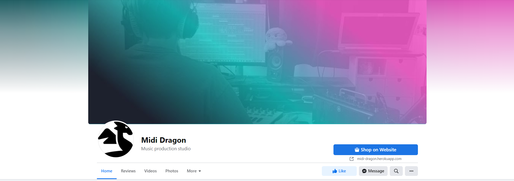
  * 
  * Cover photo matching the mididDRAGON site
  * Profile picture matching the mididDRAGON logo
  * 'Shop On Website' button which takes the user to the browse Pre-made Songs page
  * 'About' description, ink to site, contact email, price range and relevant tags
  * First post to promote the site and including the link to the site

* Email Newsletter Subscription
  * mididDRAGON uses this as their primary marketing strategy since its just a small business starting out at the moment and requires free/low cost marketing.
  * This has been implemented on midiDRAGON's site using [MailChimp](https://mailchimp.com/en-gb/)'s Newsletter Subscription form in the footer.
  * 
  * For the purposes of this project, the form is styled to fit the rest of the site and has basic error/success messages powered by MailChimp's code but doesn't actually send any newsletters.

* Content
  * midiDRAGON also slightly implements the Content marketing strategy through the [Testimonials](https://midi-dragon.herokuapp.com/songs/testimonials/) page where users' custom songs are made avaliable for other users to view and listen to, if the user who purchased it allows the song to be used as a testimonial, which helps to promote midiDRAGON's Custom Song service.
  * This is also something that could be expanded in the future to have weekly spotlight songs and other regular content promotion on the site and through the Facebook Page and Newsletter Subscription.
  * Allowing users to leave a link to their own content creation platforms in their testimonials also helps to connect the community and by having it on the midiDRAGON site, this could also motivate people to have their cusomt songs created by midiDRAGON rather than other freelance music producers.

## Search Engine Optimisation
---

### Keyword research
* Initial Process
  * Picking 3 main topics and thinking of as many relevant keywords for those topics
  * 
* Stage 2 - using Google search techniques to find more keywords
  * Checking the Google autofill suggestions
  * Adding '_' before the keyword as this acts as a 'wildcard' to give suggestions for additions to the start of the keyword
  * Checking the suggestions at the very bottom of the Google search results page
  * Thinking about the kind of searches that potential midiDRAGON customers would be making (e.g. 'personalised music gifts')
  * 
* Stage 3 - organising the list
  * Removing duplicates and organising clearly
  * 
* Stage 4 - refining the list
  * Considering the __Relevance__ of the keywords - does midiDRAGON's purpose suit the keyword (e.g. 'background music for at home' isn't exactly what midiDRAGON customers are going to be expecting from the site)
  * Considering the __Authority__ midiDRAGON has over the keyword (e.g. most keywords mentioning 'music for Youtube' return a lot of Google searches for services more specific for Youtubers than midiDRAGON)
  * Considering the __Volume__ of searches each keyword gets - and finding a balance between keywords that yield a lot of searches but also that aren't too competitive for a new small business like midiDRAGON
  * Practically, I searched for the keywords in Google and checked which ones didn't appear exactly in too many high ranking site Titles and also which keywords didn't yield too many Google ads as this also was an indication of them not being too competitive. Finally, I considered which keywords were relevant to midiDRAGON's purpose and which midiDRAGON had a reasonable amount of authority over.
  * 

* Choosing the midiDRAGON name
  * midi - Musical Instrument Digital Interface - reffers to the format that most of my music production occurs in
  * dragon - memorable and Font Awesome had a stylish looking icon to act as the logo
  * I researched whether any combinations of midi-dragon existed, but there were no music related results aside from one album name.
  * So midiDRAGON was unique, memorable and relevant enough to work well for the site.

* Semantic HTML
  * Many of the keywords contain the names of the song genres on midiDRAGON (e.g. Lofi, Cinematic, Indie) which appear many times throughout the site.
  * Some of the keywords appear in headings, buttons and the title element across the site (e.g. Pre-made Songs, Design Custom Song)
  * Some of the keywords are mentioned in the FAQs (e.g. Royalty free music, Custom Songs)
  * All of the media files used for the site also have relevant names (e.g. each Pre-made Song's image and audio file has a name to match the name of the song) which improves the SEO for the site.

* Meta Tags
  * Keyword Tag - Filling it with my refined list of keywords.
  * Description Tag - Creating a summary of the site's key features whilst making use of the keywords in my final list.

* Links to reliable and relevant external sites
  * I included links to 2 additional sites in the footer; Heroku (for the creation of the app) and Fl Studio (as the Digital Audio Workspace that I use for creating my music), since these are both reliable and reputable site which are both very relevant to midiDRAGON.
  * For the links to Heroku, FL Studio and my Facebook Business page, I used the target="_blank" attribute in order for them to be opened in a new page when clicked so that the users aren't taken away from midiDRAGON. I also included the rel="noopener noreferrer" attribute to prevent the linked site being able to have any information about or any access to my site through users clicking the link.

* robots.txt file
  * Simple text file elling the Search Engine the urls its not allowed to crawl/index.
  * Its presence in a project shows the Search Engine that you ackowledge it has access to the site and is a sign of quality, improving your ranking.
  * I created the robots.txt file in my root directory including the 'User-agent' as * indicating it applies to all SEO 'agents', listed the 'Disallows' (for my accounts, tracklist and profiles urls) and included my 'Sitemap'

* sitemap.xml file
  * Lists the site's important page urls so that the Search Engine can navigate through them, helping the Search Engine understand the site's structure, speeding up it sprocess and ensuring all the essential pages are covered.
  * I used [xml-sitemaps](https://www.xml-sitemaps.com/) to generate my sitemap.xml file
  * I then made sure I uploaded this into the root directory of my project.

## Technologies Used
---
* HTML
* CSS
* Python
* JavaScript

## Frameworks Libraries and other Applications Used
---

* Django with;
    * gunicorn
    * psycopg2
    * postgresql
    * AllAuth
    * Crispy Forms
    * django-storages
* Bootstrap
* Stripe
* boto3 (for AWS)

## Project Management
---
* Using GitHub Projects to manage this project
 * [Midi Dragon Project](https://github.com/users/mountaincharlie/projects/3/)

* Using GitHub Projects to create Epics (big features/tasks) and mark my progress throughout the project
  * 
  * 
  * 

* Using GitHub Issues to create User Stories and Project Maintenance (with GitHub’s labels to identify their type and task check lists)
  * 
  * 

* Using GitHub labels to prioritize User Stories (using MoSCoW prioritization)
  * 
  * 
  * 
  * 
  * 
  * 
  * 

## Initial Designs
---

### Header
* 

### Footer
* 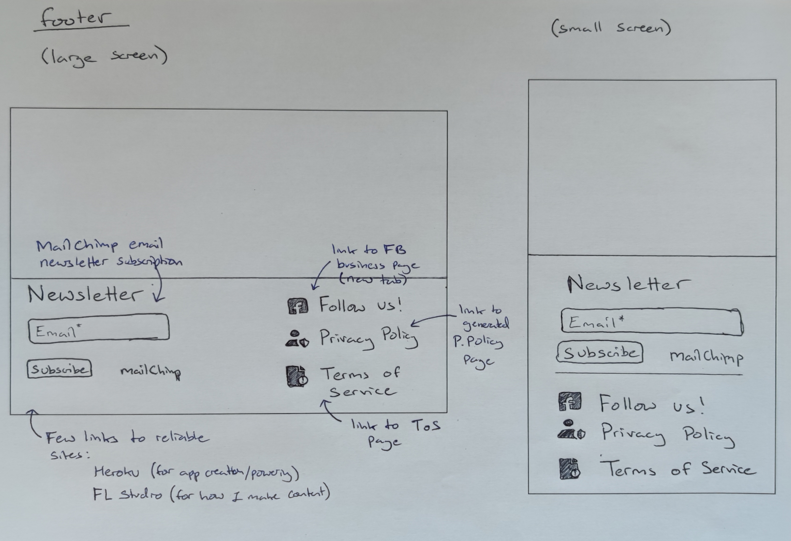

### Landing Page
* 

### Browsing Songs
* 

### Testimonials Page
* 

### Song Details
* 
* 

### Create/Edit Custom Song Page
* 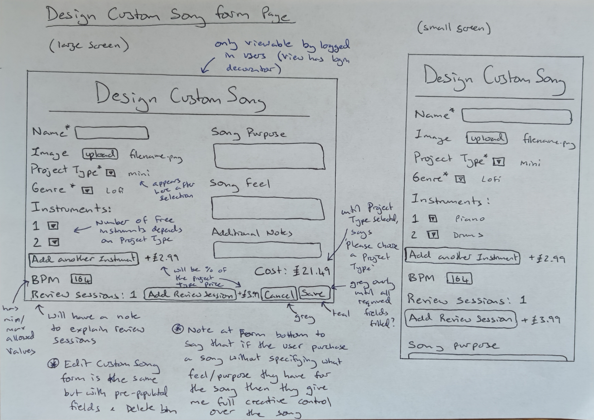

### My TrackList Page (user’s ‘basket’)
* 

### Checkout Page
* 

### Order Confirmation Page
* 

### My Profile Dashboard (contains links to Project Drafts, Projects In Progress, Completed Projects, Order History and My Details)
* My Details
  * 
* Project Drafts
  * 
* Projects In-Progress
  * 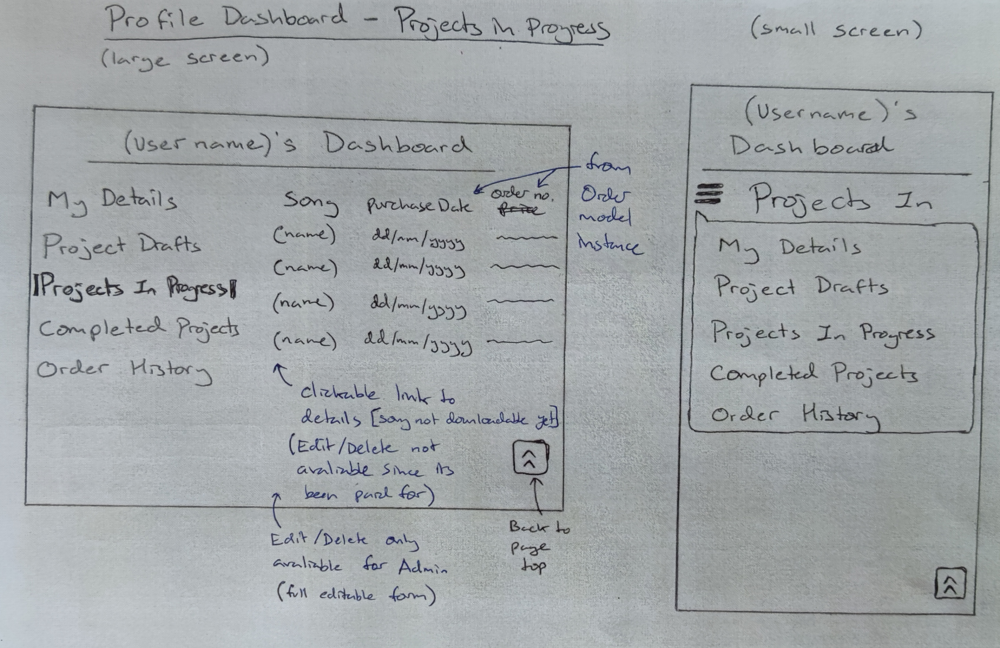
* Completed Projects
  * 
* Order History
  * 

### Admin Site Management
* Add Song
  * 
* Add Genre
  * 
* Add Instrument 
  * 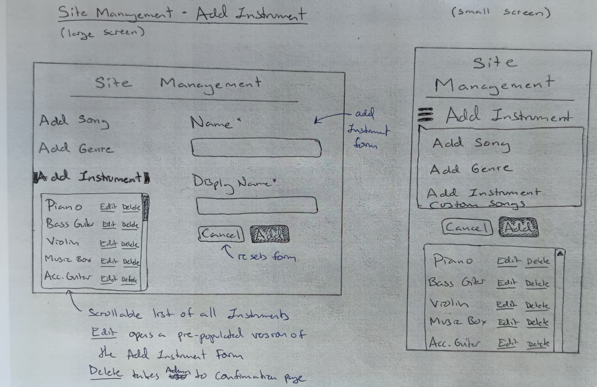
* Custom Songs 
  * 
* All Orders 
  * 

### AllAuth authentication screens
* Login 
  * 
* Register
  * 
* Logout
  * 

### Delete Confirmation Page
* 

### Custom 404 Page
* 

## Database Schema
---

### Initial Schema Plan
* A Song table containing the fields:
  * id [automatically increments]
  * name [charField, name of the song]
  * image [imageField, with a placeholder image as a default]
  * audio_video [fileField OR separate audioField and videoField]
  * slug [slugField, auto generated in pre_save() signal as a unique char string]
  * project_type [intField/ForiegnKey, 1-to-many relationship with ProjectType model]
  * owner [intField/ForiegnKey, 1-to-many relationship with Django’s User model]
  * genre [intField/ForiegnKey, 1-to-many relationship with Genre Model]
  * audio_clip [fileField, default:false, optional for users to add their own audio clip for me to use]
  * bpm [intField, beats per minute for the song]
  * song_purpose [textField, part 1 of the song description (broken down to make the form more intuitive)]
  * song_feel [textField, part 2 of the song description (broken down to make the form more intuitive)]
  * additional_details [textField, part 3 of the song description (broken down to make the form more intuitive)]
  * song_end_fade [booleanField, default: true, songs ends by fading to silence rather than ending on a beat/chord]
  * price decimalField [decimalField, max_digits=10, decimals=2, auto generated in pre_save() signal, song is a FK in OrderItems Model so that this value can be used there]
  * use_as_testimonial [booleanField, default: false, whether a song will be used as a testimonial or not]
  * testimonial [textField, optional written feedback/rating if the user is happy for their custom project to be used as a testimonial]
  * completed [booleanField, default: false, applicable for both the user’s custom projects and for pre-made songs that I’m in the process of adding to the site]
  * public [booleanField, default: False, when use_as_testimonial is True but public is False, this indicates that the song is awaiting being used as a testimonial (either while being edited or while waiting for admin approval)]

* An AddOn table containing the fields:
  * id [automatically increments]
  * type [charField, type of addOn]
  * song [intfield, the id of the song it will be applied to]
  * value [charfield, 'instrument' or 'number' (for additional review session)]
  * price [decimalfield, 'calculated from the values defined in settings.py']
  * further_details [textField, for the user to add additional notes about the addOn]  

* A ProjectType table containing the fields:
  * id [automatically increments]
  * name [charField, name of project type]
  * length [charField, possible time range for a song of each type]
  * num_included_instruments [intField, number of instruments included in each project type’s price]
  * num_included_reviews [intField, number of review sessions included in each project type’s price]
  * min_price [decimalField, price of each project type which would be the minimum price for that custom song project - if no additional instruments etc were added]

* An Instrument table containing the fields:
  * id [automatically increments]
  * name [charField, name of the instrument - used in the code]
  * display_name [charField, name of the instrument - displayed to the user]
Due to it's many-to-many relationship with the Song table, there is also an intermediate table ‘Song_Instrument’ connecting the two tables.

* A Genre table containing the fields:
  * id [automatically increments]
  * name [charField, name of the genre - used in the code]
  * display_name [charField, name of the genre - displayed to the user]

* A Like table containing the fields:
  * id [automatically increments]
  * like [charField]
Due to it's many-to-many relationship with the Song table, there is also an intermediate table ‘Song_Like’ connecting the two tables.

* Django's User table:
I used Django’s built in User model to connect to my UserProfile table with a one-to-one relationship and to my Song table with a one-to-many relationship.

* An Order table containing the fields:
  * id [automatically increments]
  * order_number [charField, non-editable and auto-created by pre_save() signal]
  * user_profile [intField, many-to-one relationship with UserProfile, related_name= "my_orders" so that in profile.html, using an “if my_orders" statement, this will check for the orders the logged in user owns]
  * full_name [charField, editable and populated from the user’s profile or the user is required to type it in]  
  * email [emailField, editable and populated from the user’s profile or the user is required to type it in]
  * date [datetimeField, auto created on Order creation when the order is placed and paid for]
  * order_total [decimalField, total cost of the order instance]

* An OrderItems table containing the fields:
  * id [automatically increments]
  * order [intField, many-to-one relationship with Order table, related_name=orderitems. Used to get the purchase date/time of a song (pre-made or custom project) for that user]
  * song [intField, one-to-one relationship with Song, related_name=songitem. Used to get the song details, like price, for the Order instance]
The items in the OrderItems table are essentially order ‘versions’ of songs that are bought, containing all of the song’s details through the relationship with the Song table and the purchase date and order_number etc through the Order table. Used to create each item in the Order history and Order confirmation displays.

* A UserProfile table containing the fields:
  * id [automatically increments]
  * user [intField, one-to-one relationship with Django’s User model]
  * phone_number [charField, optional for user’s to add if they prefer this means of contact for review sessions]

* I used [dbdiagram.io](https://dbdiagram.io/home) to create a visual representation of my database schema
* 

### Final Database Schema
* Changes
  * Added the quantity field to the SongInstrument model. While refactoring the Song and Instrument models relationship so that songs could have multiple of any particular instrument without having to create duplicates in the Instrument model.
  * Changed the Song model's audio_video field to just be the audio_file field since there wasn't enough need to allow for videos to be playable on the site since the products we are selling are the audio itself.
  * Removed the song_end_fade and audio_clip fields from the Song model as they were features that weren't really necessary for pre-made or custom songs and distracted from the important features on the Custom Design Song form.
  * Removed the AdOns model - this additional functionality was not essential to the site's function and purpose, so I've left it as a possible future feature.
  * Removed the UserProfile model since it ended up only having a 1 to 1 relationship with the Django built in User model and a 1 to many relationship with the Order model, so instead I just related the Django User model and the Order model directly via a 1 to many relationship.
  * Added the created_date field to the Song model so that the users can see in their Profile Dashboard when their projects were created.
* Final Schema diagram, using [dbdiagram.io](https://dbdiagram.io/home)
* 

## Final Designs
---

### Header
* For non-logged users:
  * On desktop
  * 
  * On mobile
  * 
  * Login menu
  * 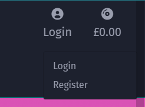
* For logged in users:
  * On desktop
  * 
  * On mobile
  * 
  * Profile menu
  * 
* For the admin:
  * On desktop
  * 
  * On mobile
  * 
  * Admin menu
  * 

* Description of features:
  * The midiDRAGON logo is a clickable link back to the landing page.
  * The searchbar allows users to search for pre-made songs by name or part of their description. This becomes an icon on mobile which is clickable to reveal a dropdown searchbar.
  * The Login/Profile/Admin icon provides the dropdown options displayed in the images above.
  * The Tracklist icon highlights teal when at least one item is in the user's Tracklist and displays the total price below it. Admins do not have access to the Tracklist since they shouldn't be able to buy their own songs.
  * The Pre-made songs button reveals a dropdown menu for sorting all the Pre-made Songs by Price, Genre, Duration, BPM or just All Pre-made Songs.
  * The Design Custom Song button takes the user to the Design Custom Song form if they are logged in, or to the login page for non-logged in users and this feature is not available for Admins.
  * The Testimonials button takes the user to the Testimonials page.
  * On mobile the above three buttons are condenseed into a hamburger icon dropdown.

### Footer
* On desktop
* 
* On mobile
* 
* FAQs Page
* 
* Privacy Policy Page
* 
* ToS Page
* 

* Description of features:
  * MailChimp Newsletter form
  * Links to reliable sites - Heroku and FL Studio
  * Facebook business page link
  * Privacy Policy page
  * Terms of Use page
* Changes from initial design:
  * Added links to reliable sites to improve SEO
  * Added FAQs page

### Landing Page
* On desktop
* 
* On mobile
* 

* Description of features:
  * Pre-made Songs information and Browse button
  * Custom Songs information and Design Custom Song button
  * What People Say About Us and Testimonials button
  * Registration information and Register Now button
* Changes from initial design:
    * More informational text (the 3 main features and one for registration)

### Browsing Songs
* On desktop
* 
* On mobile
* 

* Description of features:
  * Sort filtering dropdown
  * Filter by Genre dropdown
  * Number of songs found
  * Song layout with image, details, playable audio and 'add to tracklist' button if the user doesn't already have it in their Tracklist.
  * Each song row highlights on hover so that the details associated with a song can be seen clearly.
  * The song image and name highlights pink and cursor becomes pointer on hover to indicate that its a clickable link, which takes the user to the song details page for that song.
  * The admin can see, search and filter by all songs (even custom and incomplete and private ones) and instead of an Add To Tracklist button, they can just see if the song if Public/Private and Pre-made/Custom.
  * 

### Testimonials 
* On desktop
* 
* On mobile
* 

* Description of features:
   * Bootstrap carousel with captions/controls/indicators all styled to fit with the site, highliting on hover to indicate what can be clicked.
   * Each caption on the carousel is a clickable link to the song's details page.
   * All of the testimonial songs are also listed beneath the carousel.
   * Each image and song name is clickable link to the song's details page and each row highlights on hover like in the Browse Pre-made Songs page
* Changes from initial design:
  * Listing the Testimonial songs beneath the carousel to fit the format of the Browsing page rather than using Bootstrap cards.

### Song Details 
* On desktop
* 
* On mobile
* 

* Description of features:
  * The layout is the same for all song types (Pre-made, Custom and those that have been allowed to be used as Testimonials)
  * If the user has a song in their Tracklist, instead of being able to add it to their tracklist again, there is a note to say this is in their Tracklist already.
  * If the user have already bought the item (it’s in one of their orders) then theres a message to say that they already own this product and can find it in their dashboard.
  * For users who have purchased a custom song, but its not complete yet, there is a note to say where the song will be downloadable from and playable from when complete.
  * For purchased custom songs that are complete there is a Download button and the audio controls to play the song on the page (for the Admin the audio is always downloadable and playable, unless the song doesn't have an audio file yet in which case a specific note is displayed).
  * For custom songs which have not yet been purchased, the user has an Edit and Delete button at the bottom of the page (for the Admin these buttons are always available on every song)
  * 
  * If the song has 'use_as_testimonial' = True, then there is a section to include the testimonial text and a link to the testimonials page

### Create Custom Song
* On desktop
* 
* On mobile
* 

* Description of features:
  * Required fields have red asterisks to indicate.
  * Fields which depend on the Project Type (Included numbers of instruments and review sessions, the duration range and the price estimate) all have notes to say that a Project Type needs to be selected first. Once a Project Type is chosen, there is also a note to the user that changing the Project Type will reset those fields which depend on it.
  * 
  * 
  * The price is stated as an estimate becasue it is just calculated via JavaScript depending on the selections the user makes in the form, but on saving the form the price is calculated properly from the actual database data. This prevents users from being able to manipulate the JavaScript in order to change the song price and also if the user adds additional instruments without actually selecting instruments for all of the instrument selects on the screen, the price calculation code checks how many instruments are included with the selected project type and then only charges the set Additional Instrument price for any additional instruments from that.
  * Extra instruments can be bought and the note on the Instruments section explains how each instrument represents 1 track for that instrument, so if they want multiple electric guitar parts/tracks, then they wuold need to purchase multiple electric guitars.
  * Extra Review Sessions can be bought. The minus button is disabled at the minimum included review sessions for the Project Type, but the user doesn't have to use all of these. The plus button is disabled once the number of review sessions is 8, since this is the maximum value that i've set in my settings.py variable.
  * There are 3 optional textareas; Song Purpose, Song Feel and Additional Details, which all contain placholder text as examples of what details the user could provide. These help breakdown the important information that mididDRAGON needs in order to make the song, if the user has a specific vision for it. There is a note at the bottom to warn the user that if they don't provide specific details about the feel and structure of the song, then they give midiDRAGON creative control to make those decisions.
  * Finally there is a checkbox for the user to choose to allow their song to be used as a testimonial oncec its complete. There is a note to explain that the song is still exclusively for them and won't be downloadable or purchasable by any other users.
  * The cancel button redirects to the home page and the save button either redirects to the form if there is an error or it uses the song's get_absolute_url() method to redirect to the newly created song.

### Edit Custom Song
* An unpurchased Custom Song in its song details view
  * 
* The prepopulated Edit form for the song
  * 

* Description of features:
  * Aside from being pre-populated with the song's data, the functionality of the Edit form is identical to for the design form.
  * User's can only edit custom songs which they havent bought yet.
  * The cancel button redirects the Admin to their All Songs page and any regular logged in user to their Project Drafts page.
  * The delete button takes the user to the delete confirmation page
  * The save button either redirects to the form if there is an error or it uses the song's get_absolute_url() method to redirect to the updated song.

### Delete Confirmation Page (used for any deletion confirmation)
* The delete confirmation message is the same on desktop and mobile
  * 

* Description of features:
  * Note to the user that the action cannont be undone.
  * The cancel button redirects the Admin to their All Songs page and any regular logged in user to their Project Drafts page.
  * The delete button causes the song to be permenantley deleted from the database.

### My TrackList Page
* Desktop - adding to the Tracklist
  * 
* Mobile - adding to the Tracklist
  * 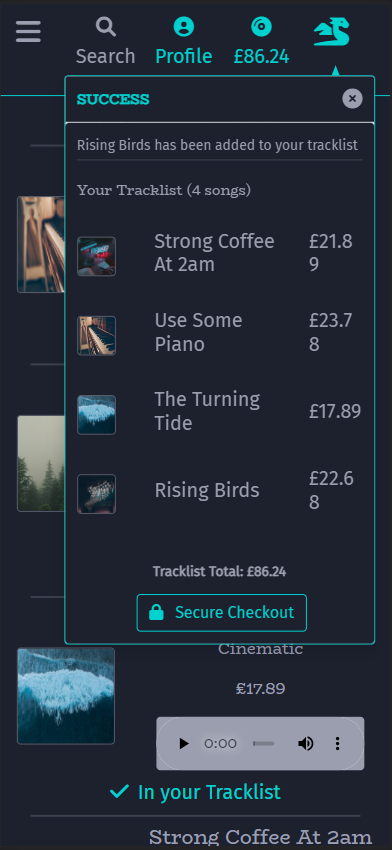
* Desktop - removing from the Tracklist
  * 
* Mobile - removing from the Tracklist
  * 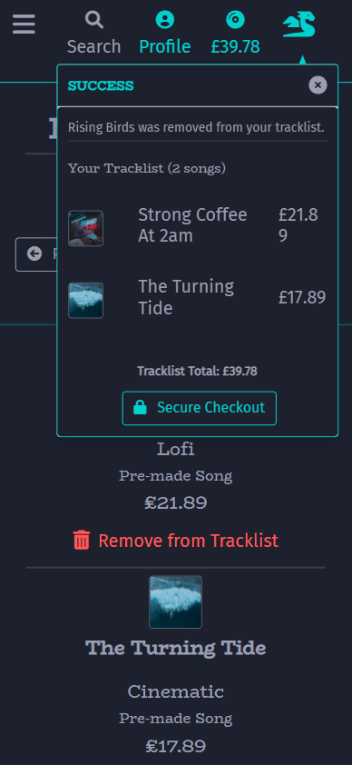

* Description of features:
  * Adding the song to the Tracklist, changes the Add To Tracklist button for that song into just a teal icon/message, so that users don't accidentally buy a song twice.
  * Removing the song from the Tracklist, changes the relevant Tracklist icons back to Add To Tracklist buttons.
  * When updating the Tracklist (adding/removing items) the success message also contains an overview of the tracklist and a button to go straight to the Checkout.
  * The price, Browse and Checkout buttons are at the bottom of the screen on desktop, but at the top on mobile, to prevent users on mobile having to scroll all the way to the bottom to see the total price.
    * 
  * If the user doesn't have anything in their Tracklist, when they view it they recieve the message below and a link to Browse Pre-made songs.
    * 

### Checkout Page
* The user's Profile - My Details page is used to update/save the Full name and email of the user and prepopulate the Checkout form
  * 
* Desktop checkout
  * 
* Mobile checkout
  * 

* Description of features:
  * Order Overview lists the songs in the order and the total price.
  * The user's details are preopoulated in teh Checkout form if the user is logged in and if the details exist for the user (might not have set a first name yet).
  * Note to the user about the importance of them making sure they have access to their provided email address, since this will be your main form of contact regarding their songs and them having a link to where they can download the song.
  * Stripe payment form [using Stripe card test details: 4242 4242 4242 4242 with an valid date and cvc]
  * Back to Tracklist redirects the user to their Tracklist.
  * Complete Order triggers the Stripe functionality and causes the payment form to be hidden so that it can't accidentally be submitted multiple times, and applies the processing-payment-overlay
    * 

### Order Confirmation Page
* Desktop Order Confirmation
  * 
* Mobile Order Confirmation
  * 

* Description of features:
  * After being purchased, the song's Add To Tracklist buttons are changed to teal icons/notes indicating that they have been purchased, so that user's don't accidentally buy the same song again.
  * 
  * Lists important order dedtails such as the order number, date and the email that the confirmation will also be sent to.
  * The email contains a link to the confirmation page since it has the links to the purchased songs aswell as the buttons to download the song if its ready (for users who don't have an account and purchased Pre-made songs, this email is important since they don't have a profile dashboard to check their order history or download their songs)
  * Order overview, like in the Checkout page
  * Links and Downloads section which contains the links to the order songs and the download buttons for all who are applicable.
  * Browse Pre-made Songs button at the bottom.
* Changes from initial design:
    * Layout change, but it still contains the same important information

### My Profile Dashboard
* My details - page contains the form for the user to update their fullname and email address. The song name is a clickable link to the song's details.
* Desktop 
  * 
* Mobile 
  * 

* Project Drafts - page contains a list of the user's custom songs which haven't been purchased yet. The song name is a clickable link to the song's details.
* Desktop 
  * 
* Mobile - with the mobile menu displayed
  * 
* If the user doesn't haven any then a message and a prompt to try designing a custom song is displayed. 
  * 

* Projects In Progress - page contains a list of the user's custom songs which have been purchased, but haven't been completed yet. The song name is a clickable link to the song's details.
* Desktop 
  * 
* Mobile 
  * 
* If the user doesn't haven any then a message and a prompt to check if any of their Project Drafts are ready to purchase. 
  * 

* Completed Projects - page contains a list of the user's custom songs which have been purchased and are complete. The song name is a clickable link to the song's details.
* Desktop 
  * 
* Mobile 
  * 
* If the user doesn't haven any then a message and a prompt to check out Pre-made Songs. 
  * 

* Order History - page contains a list of all the user's orders. The order number is a clickable link to the order overview page.
* Desktop 
  * 
* Mobile 
  * 
* If the user doesn't haven any then a message and a prompt to check out Pre-made Songs. 
  * 

### Admin Site Management
* All Songs - page contains a list of all the songs in midiDRAGON's database and their associated; user, done status, public status and use at testimonial status. The song name is a clickable link to the song's details.
* Desktop 
  * 
* Mobile
  * 
* The filters work in combination with one another and the reset filters button clears the search parameters in the url, resetting everything back.
  * 

* All Orders - page contains a list of all the orders in midiDRAGON's database and their associated; user, date and total. The order number is a clickable link to the order overview page.
* Desktop 
  * 
* Mobile
  * 
* The filters work in combination with one another and the reset filters button clears the search parameters in the url, resetting everything back.
  * 

* Django Admin Panel - a link directly into Django's Admin Panel without having to type it manually in the url.
* Showing the mobile menu
  * 

* Changes from initial design:
  * Add Song/Genre/Instrument can all be accessed easily through the Admin Panel link, so since it wasn't a high priority to implement these features, I've left them as Future Features. (Most features can still be edited for songs through the Edit Custom Song Form, which the admin has access to for every song)
  * Instead of having a section for just Custom songs, its now All Songs.

### AllAuth authentication screens
* Login
* Desktop 
  * 
* Mobile
  * 

* Logout
* Desktop/Mobile
  * 

* Register
* Desktop 
  * 
* Mobile
  * 
* Email confrimation sent
  * 
* Real email recieved
  * 
* Confirm email on midiDRAGON site
  * 

### Custom 404 Page
* Desktop 
  * 
* Mobile
  * 
* Has a Back to the music button which takes the user to the Browse Pre-made Songs page.

## User Experience Design
---

### Mobile First Design With Bootstrap 5
* In order to make my site responsive across different screen sizes, I used Bootstrap's [Grid System](https://getbootstrap.com/docs/5.0/layout/grid/) to make use of its ability to rearrange columns on the screen depending on its screen size.
* Every page on midiDRAGON can adapt from desktop screens to mobile screens without breaking any features or sarificing any of the stylsh look.

### Consistency
* Making use of Django as a templating language by creating a base.html file with title_extra, header, main and footer sections to be used across all pages and a toasts_base.html for consistency across my BS toasts.
* Each of the template html files also follow Bootstraps grid system to keep them responsive and a familiar look across the pages.
* I used primarily bootstrap classes for styling so that the layout is familiar across the whole site and created a number of custom color and background-color styles which i reused across the site similarly to how bootstrap classes are applied.
* Each page also has the same font for headings and for other text content so this also remains consistent throughout the site.
* Deciding on colour scheme at the start inorder to write style rules to implement early on and to be able to create a landing page image with the same colours used throughout the site (e.g. creating teal-btn, grey-btn and red-btn to define the 3 btn types and all of them highlight in pink on hover/selection)

### Navigation
* The site logo is a clickable link back to the homepage.
* The footer across all pages contains the link to the Facebook business page, the MailChimp email subscription form and links to the Privacy Policy, FAQs and Terms of Service pages.
* Features such as the searchbar, genre/song types search selections, My TrackList, Profile/Login and Logout/Register links are available in the header in all pages, so the user doesn't have to go anywhere specific in order to use these features.
* Throughout the site the user is prompted with messages and navigational buttons to help guide them through their experience. Evidence of this user friendly and simple navigation can be found in the Final Designs section which shows the features and functionality avaliable to users depending on their authentication, previous interactions with the site (e.g. past orders or current songs in their Tracklist) and helping them make the most of their experince with midiDRAGON.
* Cancel button on the Design Custom Song, Edit Custom Song and Delete confirmation pages so that the user doesn't have to use the browsers back button in order to cancel out of any of these features.

## Accessibility
---

### Lighthouse Accessibility Score
* 

### Semantic Elements
* Using 'header', 'nav', 'main' and 'footer' in base.html to make the roles of each section obvious.
* Adding role="button" for link elements which are being used as buttons

## Commit Messages
---

* After receiving positive feedback on the organization and consistency of my Git Commit messages on my last project, I decided to use [Conventional Commit’s](https://www.conventionalcommits.org/en/v1.0.0-beta.2/) recommended commit message structure again. 
* I used a mixture of their recommended Types and some of my own:
    * feat - new feature
    * fix - bug fixes
    * docs - documentation only changes
    * style - changes not affecting the code meaning (e.g. removing blank lines)
    * refactor - code change which isnt a fix or feature
    * test - adding a missing/correcting an existing test
    * chore - changes not affecting the source or test file (e.g. deleting unwanted files)
    * setup (custom type) - installing dependencies and adding setup code for them
* They also suggested using square brackets after the Type to add an optional Scope, which would be the thing that the commit applies to, if necessary.
* The commit messages follow the structure:
    * "type[optional scope]: commit description"

## Testing
---

### Automated Testing with Django
* In order to run these tests, I needed Django to use sqlite3 as a local database. To do this I created a 'TESTING' variable in my env.py file and then in settings.py I added an If Statement which checked for this variable and used the sqlite3 database if it was found. When I was not running tests, I commented out this variable and so Django instead used my postgresql database.
  * in my env.py:
  * 
  * in my settings.py:
  * 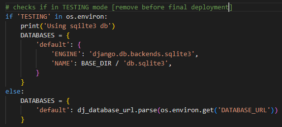
* I decided to just test my urls and some basic views with automated testing as a lot of the functionality on the site make sense to test manually (e.g. django messages and search filters, some of which have already been demonstrated in the Final Designs section).

### Testing urls
* In each of my apps, I removed the default test.py file and created my own test_urls.py file
* Tested that each of my urls resovles correctly.
* The tests were succesful for all of my urls

### Testing the home/views.py
* Tested the home url is successfully reversed and the correct template is used
* Tested the faqs url is successfully reversed and the correct template is used
* Tested the tos url is successfully reversed and the correct template is used
* Tested the privacy url is successfully reversed and the correct template is used
* These tests were all succesful

### Coverage
* After implementing 30 successful tests across my apps, I installed Django Coverage.
* Django Coverage installation to viewing html report (following [Code Institute's video](https://learn.codeinstitute.net/courses/course-v1:CodeInstitute+FST101+2021_T1/courseware/dc049b343a9b474f8d75822c5fda1582/5666926980b74689b37a0d5da3cec510/)):
    * pip3 install coverage
    * set os.environ['TESTING'] = 'yes' in my env.py
    * coverage run manage.py test
    * coverage report
    * coverage html
    * python3 -m http.server 
* Coverage report:53%
* 

### Manual Testing Site Features
* All the pages on the site are responsive across different screen sizes.
  * This was demonstrated in the screenshots for the Final Designs which show each page displaying correctly on desktop and mobile screens.

The below sections will follow the names of the Epics from my Project Management and conduct all the manual tests in the testing taslk lists.
### The base template
* The User icon in the header is different depending on the user who is logged in
  * Its grey and says 'login' for non-logged in users
  * Its teal and says 'Profile' for regular logged in users 
  * Its teal and says 'Admin' for the Admin 
* The Design Custom Song form is only accessible for logged in users
  * As a non-logged in user, clicking the Design Custom Song button or manually changing the url, redirects to the Login page.
* Django messages, with Bootstrap Toasts, display correctly
  * Desktop
  * 
  * Mobile
  * 
* The Tracklist icon changes colour and disaplys the total cost
  * This was also demonstrated in the Final Designs for the Tracklist
  * 
* The Add to Tracklist buttons for those songs have also now become coloured icons which are not buttons, so the user doesn't order multiple of the same song.
  * 
  * 
* At this point if the user logs into their account the items will still be in their Tracklist (unless they've previously purchased the song - see soon) and we can see that the success message doesn't unnecessarily show the Tracklist Overview because the message is just reffering to successful login 
  * 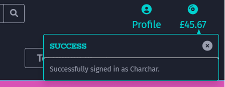
* The user 'Charchar' has previously purchased the song called 'Someplace', so if they have this song with others in their Tracklist before they've logged in and then they log in, the song 'Somplace' will be removed from the Tracklist to avoid them buying it twice 
  * Before logging in, the user has three songs in their Tracklist including 'Someplace'
  * 
  * After logging in as 'Charchar' 'Someplace' has been removed from the Tracklist, while the other two songs remain.
  * 
* The midiDRAGON logo is a clickable link back to the landing page on both mobile and desktop views.
  * This works correctly and the logo also highlights pink when hovered/clicked like the other buttons, links and clickable icons on the site.
* The options in the Pre-made Songs dropdown work correctly to sort the Pre-made Songs
  * You can also see that the filter dropdown at the top of the results has also changed to reflect the choice of ordering by song Duration
  * 

### The home app
* The landing page renders correctly.
  * Seen in the Final Designs screenshots.
* Styling has been properly applied across the site.
  * This can also be seen through all of the screenshots in the Final Designs section which shows the styling to be consistent across the whole site.
* Automated testing in the home app urls and views was all successful

### The songs app
* The Admin actions work correctly in the Admin Panel
  * A song cannot be made Public if its not Complete
  * 
  * A Compete song cannot be made Public if its audio is broken/missing
  * 
  * If a song is changed to Incomplete, then the Public status is automatically changed to False
  * 
* Only the Admin can access the Edit/Delete buttons for any song (users can only access them for their own Custom songs before purchasing them)
  * The Admin can edit Pre-made Songs
  * 
  * The Admin can edit Custom Songs
  * 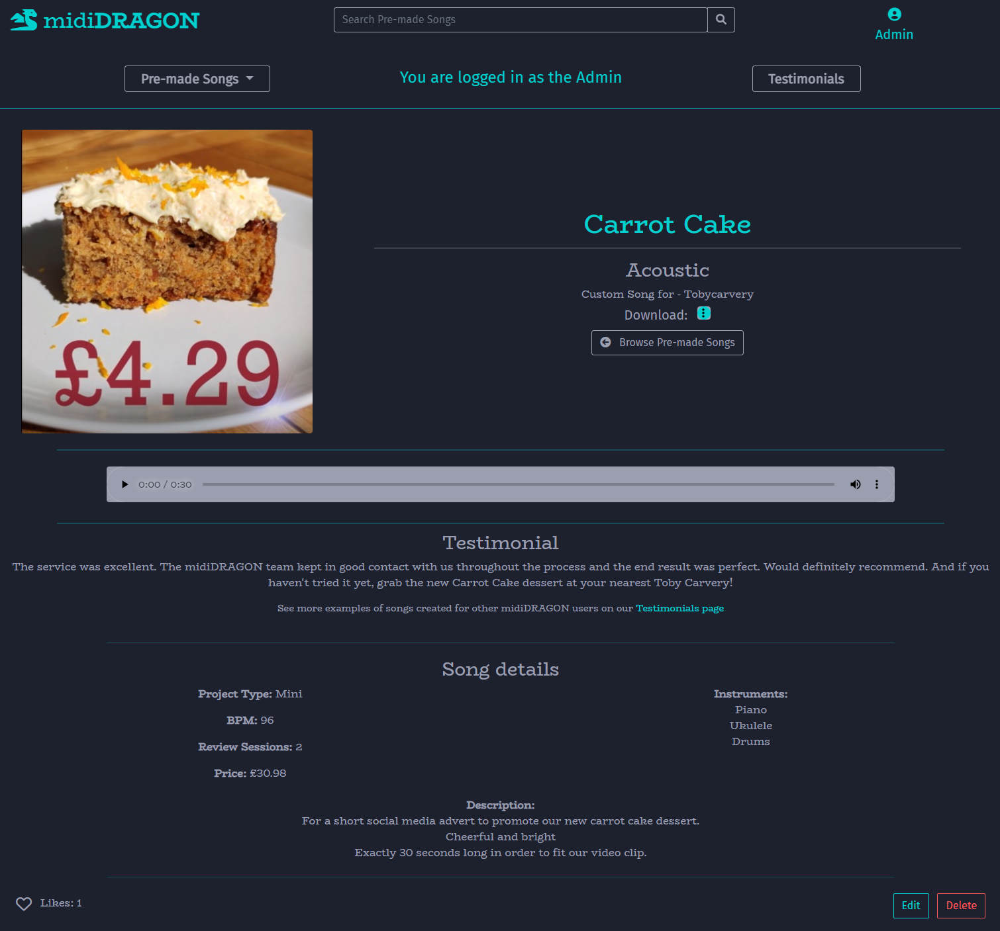
  * Regular users cannot edit any Pre-made Songs
  * 
* If a user choses to delete a song that they're allowed to, they're first taken to the Delete Confirmation page
  * 
  * If they do choose to confirm the song to be permenantly deleted then they're provided with a success message
  * 
* Typing anything into the searchbar will return the Pre-made Songs (or all songs from the Admin) with that query in their name and/or description
  * The number of search results is also correctly displayed
  * 
  * If the search query is blank, the page is refreshed and an error message is displayed
  * 
  * If the search query doesn't yeild any matches, the user is informed
  * 
* The audio controls work correctly, never autoplaying and highlighting on hover/focus
  * 
* Logged in users can click the 'like' button to show their appreciation for a song and see how many likes a song had
  * The 'like' button becomes solid grey if the user has already left a like and the number correctly changes
  * 
* Before a user adds their custom song to their Tracklist, they can see the Add To Tracklist button as well as the Edit/Delete buttons
  * 
* After a user adds their custom song to their Tracklist, they no longer have the Add To Tracklist or Edit/Delete buttons
  * 
* After purchasing their custom song explanatory notes appear where the Add To Tracklist and the Edit/Delete Buttons use to be and where the song's audio will be when complete.
  * 
* Once the purchased Custom song is complete and the Admin adds its audio file, the song becomes downloadable (button when the TRacklist button was) and the audio element for the song is available.
  * 
* If a user allows their Custom Song to be viewable as a Testimonial Song, no other users can purchase or download it. 
  * Non-logged in users are prompted to create an account to dsign their own custom song.
  * 
  * Other logged in users are prompted to show thier appreciation by leaving a 'like'
  * 
* Testimonials
  * Only songs which have their 'use_as_testimonial' field set to True are visible in the Testimonial page.
  * Each aption correctly links to the details for the song it belongs to.
  * The carousel doesn't change automatically and allows users to navigate with the controls.
  * 
* Automated testing in the song app urls was all successful

### The tracklist app
* The Add To Tracklist and Remove From Tracklist buttons work and by updating the Tracklist, the Tracklist overview should be visible in those success messages.
  * 
  * 
  * 
* The song image and name are both clickable links to the details page for the song.
* There is a specific message to the user when the last song is removed from their Tracklist
  * 
* Automated testing in the tracklist app urls was all successful

### Custom Song Form
* Only logged in, non-admin users can access the Design Custom Song form. The admin has no buttons for it in their view and is redirected to their Site Management if they alter the urls to access it. Non-logged in users are redirected to the login page if they click the button.
* The actual price of the song is calculated correctly in the back end.
  * If a user accidentally chooses to purchase an additional instrument, while one of their included instruments selects is left blank, the proper price will be calculated so that the number of included instruments for the Project Type is subtracted from the total number of instruments, before it calculates the price of additional instruments.
  * 
  * The price is correctly calculated (which is why the one on the form is called the 'Price estimate') and the instruments that the user chose for the project are correctly listed despite one of the selects being left blank on the form
  * 
* On creating the Custom Song, the success message displays correctly
  * 
* The number of review sessions buttons disable at their min/max values
  * For the regular Project Type, the number of included Review Sessions is 2 and this is treated as the minimum they can order with the song even if they don't end up wanting/needing to use all of their sessions. The maximum value is set as 8 in a variable in my settings.py
  * 
  * 
* If the BPM is given a value outside the stated range [35-155] then the form validation prevents the form being submitted but keeps it in tact (all other valid data in the form remains correct) and draws the user to the input for them to correct it.
  * 

### Messages with Bootstrap Toasts
* They display in the correct place and with the correct styling.
* They are dismissed when the 'x' icon is clicked.
* Only success messages which are to do with changes in the Tracklist display the Tracklist overview.

### The checkout app
* The Checkout can only be accessed if the user has something in their Tracklist, so if they try to manually access it, tehy are redirected with a message.
  * 
* If the admin tries to manually access the checkout, theyre redirected to their Site Management with a message.
  * 
* The Checkout form is pre-populated with the user's email and full name if provided in their Dashboard My Details page, this was demonstrated in the Final Designs section.

### Payment With Stripe
* Using the test card number: 4242 4242 4242 4242 with any valid date and cvc
* Make a purchase and check that the payment intent is successful
  * 
  * The Stripe Event was successful
  * 
  * The webhook was also successful
  * 
* To simulate a case when the user may experince an issue with their browser during the payment processing, I tried closing the browser while it was processing the payment, to check if the webhook handler works and creates an instance of Order.
  * 
  * The Stripe Event was successful
  * 
  * The webhook was also successful
  * 

### The profiles app
* Regular users are redirected to the home page with a message if they try to manually access the Site Management
  * 
* The Admin is redirected to Site Management with a message if they try to manually access the Profiles Dashboard
  * 

### PEP8 and Pylint Python Validators
* checkout/admin.py
  * no pylint warnings/errors
  * PEP8 result: All right
* checkout/apps.py
  * any pylint warnings for unused import checkout.signals and that its imported but not used, but this is because its just being used to override the ready method of the class.
  * PEP8 result: All right
* checkout/forms.pt
  * no pylint warnings/errors
  * PEP8 result: All right
* checkout/models.py
  * has pylint error: Instance of 'ForeignKey' has no 'order_number' member, but the function returns it fine.
  * PEP8 result: All right
* checkout/signals.py
  * has pylint warnings Unused argument 'kwargs'/'sender'/'created' but these are either optional arguments or arguments specifically required by the signal functions. 
  * PEP8 result: All right
* checkout/urls
  * no pylint warnings/errors
  * PEP8 result: All right
* checkout/views.py
  * has 4 pylint warnings for line too long, but these are for Django messages and I can't break these messages onto different lines without causing serious errors.
  * has pylint arror: Class 'OrderSong' and 'Order' have no 'objects' member', and 'User' has no 'DoesNotExist' member, but using 'objects' and 'DoesNotExist' works perfectly well for this project.
  * has pylint warnings Unused argument 'kwargs'/'sender'/'created' but these are either optional arguments or arguments specifically required by the functions.
  * has pylin warning: Catching too general exception Exception, but this is the point, we want to capture an errors that may occur.
  * PEP8 result: only 5 'line too long' errors, explained above
* checkout/webhook_handler.py
  * has 5 pylint warnings for models not having 'objects' or 'DoesNotExist' member, but these functions work completely fine. 
  * has 3 pylint warnings for line to long, but these are all for the content of HttpResponses and I have no way to make thses shorter without losing important information.
  * has pylint warning: Catching too general exception Exception, but this is the point, we want to capture an errors that may occur.
  * PEP8 result: only 3 'line too long' errors, explained above
* checkout/webhooks.py
  * has 2 pylint warnings for local variable 'e' is assigned to but never used, but this section is from Stripe's documentation
  * has pylint warning: Catching too general exception Exception, but this is the point, we want to capture an errors that may occur.
  * has 1 pylint warning for line to long but this is for a variable used as part of Stripe's documentation which just happen to have very long names (handler.handle_payment_intent_payment_failed)
  * PEP8 result: only 1 'line too long' errors, explained above
* home/urls
  * no pylint warnings/errors
  * PEP8 result: All right
* home/views.py
  * has pylint warnings: Class 'Order' has no 'objects' member and Class 'OrderSong' has no 'objects' member, but these functions work completely fine. 
  * PEP8 result: All right
* profiles/urls
  * no pylint warnings/errors
  * PEP8 result: All right
* profiles/forms
  * no pylint warnings/errors
  * PEP8 result: All right
* profiles/views
  * has 5 pylint warnings for line too long, but they are all for messages which I cant make shorter and context dictionaries with really long variable names.
  * has 15 pylint warnings for classes having no'objects' member, but these functions all work completely fine. 
  * has 18 pylint warnings for Unused argument 'kwargs'/'args' but these are optional arguments anyway
  * has pylint warning: Catching too general exception Exception, but this is the point, we want to capture an errors that may occur.
  * PEP8 result: only 5 'line too long' errors, explained above
* songs/admin.py 
  * one pylint warnings for line too long, but its for an if statment that I can't shorten
  * 3 pylink warnings for Unused argument 'request', but the functions require them and work fine
  * PEP8 result: only 1 'line too long' errors, explained above
* songs/apps.py
  * any pylint warnings for unused import checkout.signals and that its imported but not used, but this is because its just being used to override the ready method of the class.
  * PEP8 result: All right
* songs/forms.py
  * has 4 pylint warnings for line too long, but they are all for my placeholder text descriptions which I cant make shorter.
  * has 3 pylint warnings for classes having no'objects' member, but these functions all work completely fine.
  * PEP8 result: only 4 'line too long' errors, explained above
* songs/models.py
  * has 3 pylint warnings for _ _ str_ _ does not return str, but this all works completely fine.
  * has 1 pylint warning for line too long but this is for an if statement that I can't make any shorter.
  * has 1 pylint warning for Instance of 'ManyToManyField' has no 'count' member, but this functions all work completely fine.
  * has 1 pylint warning for Instance of 'CharField' has no 'lower' member, but these functions all work completely fine.
  * PEP8 result: only 1 'line too long' errors, explained above
* songs/signals.py
  * has 6 pylint warning for line too long but they're all for calculations with variables that need log descriptive names.
  * has 2 pylint warnings for classes having no'objects' member, but these functions all work completely fine.
  * has 2 pylint warnings for Unused argument 'kwargs'/'sender' but these are optional arguments anyway
* songs/urls
  * no pylint warnings/errors
  * PEP8 result: All right
* songs/view.py
  * has many pylint warnings for classes having no'objects' member, but these functions all work completely fine.
  * has a few pylint warning for line too long but they're all for messages and long named variables which cant be changed.
  * PEP8 result: some 'line too long' errors, explained above
  * PEP8 result: 4 line break warnings, but these were just so that I could have my Q operators on seperate lines rathern than none massive one.
* tracklist/contexts.py
  * has 2 pylint warnings for classes having no'objects' member, but these functions all work completely fine.
* tracklist/urls
  * no pylint warnings/errors
  * PEP8 result: All right
* tracklist/urls
  * has 2 pylint warning for line too long but they're both for messages which I cant shorten any further.
  * has 18 pylint warnings for Unused argument 'kwargs'/'args' but these are optional arguments anyway

### HTML Validation in Offical W3C Validator (including some likely warnings due to using a templating language)
* checkout.html
  * Did have the error resulting from me having a p element as a child of a button, which I ammended
  * has some Offical W3C Validator errors for using {{ }} and  syntax, but these are necessary for Django functionality
  * has some Offical W3C Validator errors for missing head element information, but this file extends from base.html which contains the head element
* order_confirmation.html
  * Wasn't allowed the alt atribute on the source element, which I ammended
  * has some Offical W3C Validator errors for using {{ }} and  syntax, but these are necessary for Django functionality
  * has some Offical W3C Validator errors for missing head element information, but this file extends from base.html which contains the head element
* FAQs.html
  * has some Offical W3C Validator errors for using {{ }} and  syntax, but these are necessary for Django functionality
  * has some Offical W3C Validator errors for missing head element information, but this file extends from base.html which contains the head element
* index.html
  * has some Offical W3C Validator errors for using {{ }} and  syntax, but these are necessary for Django functionality
  * has some Offical W3C Validator errors for missing head element information, but this file extends from base.html which contains the head element
* privacy_policy.html
  * has some Offical W3C Validator errors for using {{ }} and  syntax, but these are necessary for Django functionality
  * has some Offical W3C Validator errors for missing head element information, but this file extends from base.html which contains the head element
* terms_of_service.html
  * has some Offical W3C Validator errors for using {{ }} and  syntax, but these are necessary for Django functionality
  * has some Offical W3C Validator errors for missing head element information, but this file extends from base.html which contains the head element
* dashboard_completed_projects.html
  * Had a type not allowed on div warning and a div missing role attribute for line 24, which I ammended
  * has some Offical W3C Validator errors for using {{ }} and  syntax, but these are necessary for Django functionality
  * has some Offical W3C Validator errors for missing head element information, but this file extends from base.html which contains the head element
* dashboard_my_details.html
  * Had a type not allowed on div warning and a div missing role attribute for line 24, which I ammended and for the other html files which follow a similar structure.
  * has some Offical W3C Validator errors for using {{ }} and  syntax, but these are necessary for Django functionality
  * has some Offical W3C Validator errors for missing head element information, but this file extends from base.html which contains the head element
* dashboard_order_history.html
  * has some Offical W3C Validator errors for using {{ }} and  syntax, but these are necessary for Django functionality
  * has some Offical W3C Validator errors for missing head element information, but this file extends from base.html which contains the head element
* dashboard_project_drafts.html
  * has some Offical W3C Validator errors for using {{ }} and  syntax, but these are necessary for Django functionality
  * has some Offical W3C Validator errors for missing head element information, but this file extends from base.html which contains the head element
* dashboard_projects_in_progress.html
  * has some Offical W3C Validator errors for using {{ }} and  syntax, but these are necessary for Django functionality
  * has some Offical W3C Validator errors for missing head element information, but this file extends from base.html which contains the head element
* order_overview.html
  * Wasn't allowed the alt atribute on the source element, which I ammended
  * has some Offical W3C Validator errors for using {{ }} and  syntax, but these are necessary for Django functionality
  * has some Offical W3C Validator errors for missing head element information, but this file extends from base.html which contains the head element
* site_management_all_orders.html
  * has some Offical W3C Validator errors for using {{ }} and  syntax, but these are necessary for Django functionality
  * has some Offical W3C Validator errors for missing head element information, but this file extends from base.html which contains the head element
* site_management_all_songs.html
  * has some Offical W3C Validator errors for using {{ }} and  syntax, but these are necessary for Django functionality
  * has some Offical W3C Validator errors for missing head element information, but this file extends from base.html which contains the head element
* admin-all-orders-list.html
  * has a number of Offical W3C Validator errors for using {{ }} and  syntax, but these are necessary for Django functionality
  * has a number of Offical W3C Validator errors for missing head element information, but this file extends from base.html which contains the head element
* admin-all-songs-list.html
  * has a number of Offical W3C Validator errors for using {{ }} and  syntax, but these are necessary for Django functionality
  * has a number of Offical W3C Validator errors for missing head element information, but this file extends from base.html which contains the head element
* completed-projects-list.html
  * has some Offical W3C Validator errors for using {{ }} and  syntax, but these are necessary for Django functionality
  * has some Offical W3C Validator errors for missing head element information, but this file extends from base.html which contains the head element
  * The Offical W3C Validator thinks that the h4 on line 15 is empty, but it actually contains an icon.
* my-details-form.html
  * has some Offical W3C Validator errors for using {{ }} and  syntax, but these are necessary for Django functionality
  * has some Offical W3C Validator errors for missing head element information, but this file extends from base.html which contains the head element
* order-history.html
  * has some Offical W3C Validator errors for using {{ }} and  syntax, but these are necessary for Django functionality
  * has some Offical W3C Validator errors for missing head element information, but this file extends from base.html which contains the head element
*project-drafts.html
  * has some Offical W3C Validator errors for using {{ }} and  syntax, but these are necessary for Django functionality
  * has some Offical W3C Validator errors for missing head element information, but this file extends from base.html which contains the head element
* projects-in-progress.html
  * has some Offical W3C Validator errors for using {{ }} and  syntax, but these are necessary for Django functionality
  * has some Offical W3C Validator errors for missing head element information, but this file extends from base.html which contains the head element
* delete_song.html
  * has some Offical W3C Validator errors for using {{ }} and  syntax, but these are necessary for Django functionality
  * has some Offical W3C Validator errors for missing head element information, but this file extends from base.html which contains the head element
* design_custom_song.html
  * has some Offical W3C Validator errors for using {{ }} and  syntax, but these are necessary for Django functionality
  * has some Offical W3C Validator errors for missing head element information, but this file extends from base.html which contains the head element
* edit_custom_song.html
  * has some Offical W3C Validator errors for using {{ }} and  syntax, but these are necessary for Django functionality
  * has some Offical W3C Validator errors for missing head element information, but this file extends from base.html which contains the head element
* songs_details.html
  * has some Offical W3C Validator errors for using {{ }} and  syntax, but these are necessary for Django functionality
  * has some Offical W3C Validator errors for missing head element information, but this file extends from base.html which contains the head element
* testimonials.html
  * has some Offical W3C Validator errors for using {{ }} and  syntax, but these are necessary for Django functionality
  * has some Offical W3C Validator errors for missing head element information, but this file extends from base.html which contains the head element
* desktop-song-list-headings.html
  * has some Offical W3C Validator errors for using {{ }} and  syntax, but these are necessary for Django functionality
  * has some Offical W3C Validator errors for missing head element information, but this file extends from base.html which contains the head element
* desktop-song-list.html
  * has some Offical W3C Validator errors for using {{ }} and  syntax, but these are necessary for Django functionality
  * has some Offical W3C Validator errors for missing head element information, but this file extends from base.html which contains the head element
* desktop-testimonials-list-headings.html
  * has some Offical W3C Validator errors for using {{ }} and  syntax, but these are necessary for Django functionality
  * has some Offical W3C Validator errors for missing head element information, but this file extends from base.html which contains the head element
* mobile-song-list.html
  * has some Offical W3C Validator errors for using {{ }} and  syntax, but these are necessary for Django functionality
  * has some Offical W3C Validator errors for missing head element information, but this file extends from base.html which contains the head element
* mobile-testimonials-list.html
  * has some Offical W3C Validator errors for using {{ }} and  syntax, but these are necessary for Django functionality
  * has some Offical W3C Validator errors for missing head element information, but this file extends from base.html which contains the head element
* tracklist.html
  * has some Offical W3C Validator errors for using {{ }} and  syntax, but these are necessary for Django functionality
  * has some Offical W3C Validator errors for missing head element information, but this file extends from base.html which contains the head element
* price-and-buttons.html
  * has some Offical W3C Validator errors for using {{ }} and  syntax, but these are necessary for Django functionality
  * has some Offical W3C Validator errors for missing head element information, but this file extends from base.html which contains the head element
* desktop-tracklist-headings.html
  * has some Offical W3C Validator errors for using {{ }} and  syntax, but these are necessary for Django functionality
  * has some Offical W3C Validator errors for missing head element information, but this file extends from base.html which contains the head element
* add-to-tracklist-form.html
  * has some Offical W3C Validator errors for using {{ }} and  syntax, but these are necessary for Django functionality
  * has some Offical W3C Validator errors for missing head element information, but this file extends from base.html which contains the head element
* base.html
  * has some Offical W3C Validator errors for using {{ }} and  syntax, but these are necessary for Django functionality
  * has some Offical W3C Validator errors for missing head element information, but this file extends from base.html which contains the head element
* mobile-header.html
  * has some Offical W3C Validator errors for using {{ }} and  syntax, but these are necessary for Django functionality
  * has some Offical W3C Validator errors for missing head element information, but this file extends from base.html which contains the head element
* footer.html
  * has some Offical W3C Validator errors for using {{ }} and  syntax, but these are necessary for Django functionality
  * has some Offical W3C Validator errors for missing head element information, but this file extends from base.html which contains the head element
* desktop-header.html
  * has some Offical W3C Validator errors for using {{ }} and  syntax, but these are necessary for Django functionality
  * has some Offical W3C Validator errors for missing head element information, but this file extends from base.html which contains the head element
* customised version of django-all_auth's login.html
  * has some Offical W3C Validator errors for using {{ }} and  syntax, but these are necessary for Django functionality
  * has some Offical W3C Validator errors for missing head element information, but this file extends from base.html which contains the head element
* customised version of django-all_auth's logout.html
  * has some Offical W3C Validator errors for using {{ }} and  syntax, but these are necessary for Django functionality
  * has some Offical W3C Validator errors for missing head element information, but this file extends from base.html which contains the head element
* customised version of django-all_auth's signup.html
  * has some Offical W3C Validator errors for using {{ }} and  syntax, but these are necessary for Django functionality
  * has some Offical W3C Validator errors for missing head element information, but this file extends from base.html which contains the head element

### CSS Validation in Offical Jigsaw Validator
* base.css
  * No errors or warnings in Offical Jigsaw Validator

### JS Check in JSHint
* stripe_elements.js
  * JSHint says it has 2 undefined variables, 'Stripe' which is directly from Stripe's documentation for how to use its JavaScript, and '$' which just refer to the lines where I use JQuery's .fadeToggle method.
  * Other than this, there are no serious errors or warning in JSHint
* Javascript at the bottom of site_management_all_songs.html
  * no errors or warning in JSHint
* Javascript at the bottom of site_management_all_orders.html
  * no errors or warning in JSHint
* customSong.js
  * JSHint says that srcElement is alreay defined and out of scope, but the was that its set up works, so no serious errors or warnings in JSHint.
* Both small JavaScriptsat the bottom of songs/songs.html
  * no errors or warning in JSHint

## Bugs [TO FINISH]
---

### Bugs and Fixes
* Bug: after setting the background-color for the dropdown-menus in the site header to dark grey, when hovering over each item, the background changed to white.
  * Fix: targetting the dropdown-menu hover in base.css and overriding the Bootstrap 5 highlighting, keeping the background-color as dark grey while the links' text was pink on hover.
* Bug: when setting up the header for mobile (small screens) when selecting the Profile/Login icon or expanding the burger icon, their dropdown-menus displayed on the left-hand side of the screen instead of below them.
  * Fix: adding the mobiledropdowncontainer class to both divs containing the dropdown menus and setting their position to relative in base.css, as recommended by [Roy](https://stackoverflow.com/a/35956506) 
* Bug: when I was creating my first instance for the Song model, the slug field would not be set on saving the instance since the slug field had the 'blank=False' constraint.
  * Fix: I replaced the constraint with 'null=True, blank=True' so that the slug could be set by my custom unique_slug_generator method on save.
* Bug: When creating my SongAdmin action methods, in the Songs app admin.py, I had trouble accessing the public field for the instance inorder to check if its value was True or False and to update its value accordingly.
  * Fix: through some trial and error and print statements, I found that the syntax to access the public field's value from the instance was: queryset[0].public.
* Bug: I realised that by using the syntax: queryset[0] I didn't allow for the cases where the selected songs had different values for public/completed/testimonial status and so only the first song's field value was being changed.
  * Fix: I included a for loop in each action method to check the field status for each song in the field set individually. This also resulted in me using the syntax: song.public (to access the field value), song.public = False (to change the field value) and song.save() (to save the change).
* Bug: When manually testing if my header search form worked, the form was only submitted when I hit enter, not when clicking on my search icon.
  * Fix: I had my submit 'button' made from a div element, styled to look like my buttons and with type="submit" and role="button" but the div actually needed to be a button element inorder for it to successfully submit the form.
* Bug: when trying to set the ImageField for my Song model to use my 'placeholder.jpg' as its default image, this only worked when also removing the 'blank=True' option and only for initially creating the Song instance without selecting an image. But without the 'blank=True' it was impossible to clear an existing image from a Song instance, so it would never have the placeholder image set for it.
  * Fix: I added the 'blank=True' back to the ImageField and then where I was overriding the Song model's save method, I added a condition to check if the Song instance didn't have an image and if not, set it to be the 'placeholder.jpg'
* Bug: When creating my select element for filtering searches by Genre, my if statement for setting the 'selected' attribute was not working ocrrectly, even when the Javascript and views logic was working correctly to filter search results.
  * Fix: I removed the {{  }} and ' ' I was using within the 'if selected_genre' statements, which wasn't necessary since these aren't required when already inside template tags (an if statement in this case).
* Bug: When setting up my testimonials template, even though my views and url path were created correctly, I was still receiving a 404 error when trying to open the template in the server. 
  * Fix: I needed to move my testimonials url path above my other urls which contained variables (slugs) since Django searches through the url paths in the order they're written and expects them in order of fewest variables first.
* Bug: When saving custom song forms where the song had capital letters in the name, the unique_slug_generator() method kept being triggered becuase of the way that I was checking if a song's naem had been changed ( not self.slug.split('-')[:-1] == self.name.split(' ') ).
  * Fix: Realising that the the way I was checking the song.name with the slug didn't account for capital letters, I then applied python's .lower() method ( not self.slug.split('-')[:-1] == self.name.lower().split(' ') ) 
* Bug: When saving the custom song form, the formset manager was using the empty instrument form multiple times instead of the clones I had made with the correct values.
  * Fix: Because I was replacing '__ prefix __' with the instrument name rather than a number, the formset manager ignored these created forms, so I had to set up a variable to countr from 0 upwards as I iterated over all the chosen instruments so that I could create their form ids correctly.
* Bug: The formset manager used the empty instrument form as the first of its 'TOTAL_NUM_FORMS' since this hidden empty form was above where I was creating my new instrument forms.
  * Fix: I needed to move the empty form below the container for my created forms so that the formset manager just used the created ones.
* Bug: Trying to use .selected = true/false didn't work when I was trying to change the selected select options for instruments in my custom song form.
  * Fix: I needed to use the .setAttribute() method.
* Bug: When using the .setAttribute() to unselect some instrument options, I used .setAttribute('selected', 'false') but this actually just ll the options to selected and so when it was saved, the form set all the selects to have the final option selected regardless of what was actually chosen.
  * Fix: After discovering that having any 2nd argument for .setAttribute('selected', '2nd_argument') would set the option as selected and that .removeAttribute('selected') should be used, I used the .removeAttribute() method for making sure all unchosen options were not selected, instead.
* Bug: After changing the newly created instruments form's id '__ prefix __' to a number rather than their name, it meant that my method for checking for duplicated instruments and increasing their quantity on one form instead of creating multiple, no longer worked.
  * Fix: I used the list of selected instruments to create a dictionary of instruments as keys with their quantities as their values. Then rather than having an if statement to check if a form already existed for an instrument, I just created the new instrument forms and straight away updated their quannity input value from the disctionary value.
* Bug: When submitting the form in the edit_custom_song template, the formset kept returning as invalid, causing it to keep the old data instead of saving any changes to the instruments. On inspecting the invalid formsets in the terminal, I could see that some of the instruments had error notes saying that they were a requireed field even though they contained the right data.
  * Fix: Setting the value of the formset management div with id="id_song_instruments-INITIAL_FORMS" to zero, since the whole formset was being recreated anytime the user made any changes to the formset, so it wasn't necessary to be tracking the number of initial forms.
* Bug: Whenever a success message was being displayed, an overview of the tracklist was also being displayed, even if the user was just logging in or saving a custom song design.
  * Fix: I set an if statement in the toast_success snippet to only display the tracklist overview if a session variable 'updating_tracklist' had the value 'true'. Then in the AddToTracklist and RemoveFromTracklist views, I set the 'updating_tracklist' session variable to 'true' and in the contexts.py file I stored the session variable's value in a local 'updating_tracklist' variable. I then set a show_tracklist_overview_in_message variable to have the value from the 'updating_tracklist' variable and then set 'updating_tracklist' to 'false' and pass the 'show_tracklist_overview_in_message' into the context dictionary.
* Bug: When I added the url path to my delete button in the edit_custom_song template, everytime I tried to access the edit page, I got an error saying that there was no reverse for 'delete_confirmation'.
  * Fix: I realised that I was not passing the actual song instance into the edit_custom_song template, so I added this to the context in the EditCustomSong() view get method.
* Bug: My method for checking for the 'updating_tracklist' session variable and showing or not showing the rtacklist overview with any success messages appeared to not be working. After adding one item to the tracklist it would then always show the rtacklist overview in success messages, regardless of what they were for.
  * Fix: In contexts.py when I was changing the 'updating_tracklist' to 'false' this was actually only changing the value of the local variable, not updating the session variable, so I changed: updating_tracklist = 'false' to be: request.session['updating_tracklist'] = 'false'. After making this change it was also clear that the 'show_tracklist_overview_in_message' local variable was redundant, so I just used the local 'updating_tracklist' instead.
* Bug: 
  * Fix:

### Unfixed Bugs
* No known unfixed bugs (other than warnings/errors explained in code validation section)

## Deployment
---

### Early Deployment to Heroku
* First I created the midi-dragon app on Heroku
* Then I added my Heroku Postgres database in Heroku's Resources -> Add Ons
* I created an env.py file in my root directory and made sure that it was listed in my .gitignore so that it would never be commited to GitHub
* I copied the link to my Heroku database from the Heroku Config Variable and pasted it into my env.py file
* In my env.py file I created variables for my DATABASE_URL and my SECRET_KEY
* I gave my SECRET_KEY a value and created a Heroku Config Variable for this 
* I then changed my default database to use dj_database_url and DATABASE_URL
* In my settings.py file I set my Heroku app as a localhost in my ALLOWED_HOSTS variable
* I created a 'DISABLE_COLLECTSATIC' Config Variable in Heroku with a value of '1', since I didn't have any staticfiles at that time
* I then created a Procfile for my app
* Setup automatic deploys with Github

### Final Deployment to Heroku
* In settings.py set DEBUG = 'DEVELOPMENT' in os.environ, so that in development mode DEBUG = True, but in the Heroku app DEBUG = False
* I then set up my AWS bucket following [Code Institue's tutorial](https://learn.codeinstitute.net/courses/course-v1:CodeInstitute+EA101+2021_T1/courseware/eb05f06e62c64ac89823cc956fcd8191/40cc2543c48643fda09351da6fa90579/)
* I added my AWS_ACCESS_KEY_ID, AWS_SECRET_ACCESS_KEY and the USE_AWS as True in Heroku config vars to complete the set up of AWS with my Heroku app
* I then removed my 'DISABLE_COLLECTSATIC' Config Variable since I did have staticfiles
* I added my STRIPE_PUBLIC_KEY, STRIPE_SECRET_KEY and STRIPE_WH_SECRET (from a new Webhook Endpoint which I created for the deployed site) to the Heroku config vars to complete my setup with Stripe on my Heroku app
* I added my EMAIL_HOST_USER and EMAIL_HOST_PASS value to Heroku config vars to complete my connection of Gmail SMTP service with my Heroku app (for sending order confirmation and account verification emails)

### Deployed site link
* [midiDRAGON](https://midi-dragon.herokuapp.com/)

## Credits [TO FINISH]
---

### Helpful Resources
* [dbdiagram.io](https://dbdiagram.io/home) for creating my initial and final database schema designs.
* [GeeksforGeeks' solution](https://www.geeksforgeeks.org/how-to-remove-arrow-in-dropdown-in-bootstrap/) for how to remove the arrow from the Bootstrap dropdowns.
* [cssgradient's online tool](https://cssgradient.io/) used to help visualise the homepage background gradient.
* [Typewolf](https://www.typewolf.com/google-fonts) for finding the best Google fonts for this project.
* [Code Institute's 'friendly_name' models field idea](https://github.com/Code-Institute-Solutions/boutique_ado_v1/blob/f6c3de32aa152b98da174daba13412388258b9b8/products/models.py) for how to have a programamtic and displayed version of my Genre and Instrument instances. This was useful because the search functionality required the Genre and Instrument names to be written programatically (with no uppercases or spaces) but it was better for the UXD for the Genre and Instrument names to contain uppercases and spaces when displayed to users.
* [Code Institute's idea for creating order numbers by overriding the default save method](https://github.com/Code-Institute-Solutions/boutique_ado_v1/blob/f6c3de32aa152b98da174daba13412388258b9b8/checkout/models.py) for how to call my unique_slug_generator method to make sure that all Song instances have a slug, which is used in urls as a unique identifier to avoid exposing mydatabase's primary keys.
* [Tom's solution on Stackoverflow](https://stackoverflow.com/a/42426801) for how to use Django's PositiveIntegerField with minimum and maximum value constraints.
* [Fagan Media's page](https://www.faganmedia.com/support/disable-download-button-for-html5-audio-and-video-player) for how to disable the 'download' option from the audio element.
* [Point Clear Media's page](https://pointclearmedia.com/2020/08/27/css-styling-the-audio-element/) for how to target parts of the audio element to style it. 
* [W3School's page](https://www.w3schools.com/howto/howto_js_get_url.asp) for how to get the current window's url with javascript.
* [Metring's page](https://ricardometring.com/getting-the-value-of-a-select-in-javascript) for how to get the value of a selected select option with javascript.
* [Code Institute's idea for setting a background image on the body element and then using an overlay to cover it on other pages](https://github.com/Code-Institute-Solutions/boutique_ado_v1/blob/933797d5e14d6c3f072df31adf0ca6f938d02218/static/css/base.css) for why I set a background image on my body element, which is visible on the landing page and on pages where I just wanted my dark grey background I craeted a custom overlay. The reason I applied this to the body for all pages instead of just the landing page is that the body background image loads quicker than other content on the page, so if a page takes a moment to load fully, the site's landing page image is visible in the background instead of a plain white background.
* CodingEntrepreneurs's videos on [get absolute url](https://www.youtube.com/watch?v=b42B-xli-vQ&list=PLEsfXFp6DpzRMby_cSoWTFw8zaMdTEXgL&index=47) and [Django URLs Reverse](https://www.youtube.com/watch?v=rm2YTMc2s10&list=PLEsfXFp6DpzRMby_cSoWTFw8zaMdTEXgL&index=46) for how to implement the get_absolute_url method on my Song model.
* Django Adventure's page on [How to create file download links in Django?](https://djangoadventures.com/how-to-create-file-download-links-in-django/) for the last part of how I wrote the logic for downloading a song to a user's device in my DownloadSong view. Most of the view's functionality is custom code but the overall logic was heavily influenced by Django Adventure's page.
* [Banjer's solution on Stackoverflow](https://stackoverflow.com/a/10290401) for how to use Django's template tags to truncate values by a number of characters. I used this for my testimonials page so that long testimonials text wouldn't cause the layout to break or become mishappen.
* [im_brian_d's solution on Stackoverflow](https://stackoverflow.com/a/26133651) for how to stop Bootstrap carousels from auto changing slides, using the data-bs-interval="false" attribute on the carousel itself.
* [russ_ferri's solution on Stackoverflow](https://stackoverflow.com/a/11552460) and [w3schools' page on object-fit](https://www.w3schools.com/csS/css3_object-fit.asp) for how to correctly position and fit images centrally with css rules. I used this for the testimonial carousel images so that they always filled the container without being streched, but also were cetralised.  
* [Abdul Niyas P M's solution on Stackoverflow](https://stackoverflow.com/a/56645085) for how to change the default django form labels for form fields in forms.py.  
* [ClarkTheCoder's solution on Stackoverflow](https://stackoverflow.com/a/51351682) for how to add placeholder text to Textarea fields using django widgets in forms.py.  
* [Daniel Roseman's solution on Stackoverflow](https://stackoverflow.com/a/55237245) for using values_list() method to get a queryset for Genre with each value by its display_name for using in the form dropdown.  
* [Ishita Kabra's solution on Stackoverflow](https://stackoverflow.com/a/68891518) for how to add css style rules to the file-upload-button, which I used to style my image upload button in my Design Custom Song form.  
* [Eliakin Costa's solution on Stackoverflow](https://stackoverflow.com/a/59364708) for how to apply an 'empty_label' attribute to django's ModelChoiceFields, which I used for my project_type and genre fields.  
* [TLindig's solution on Stackoverflow](https://stackoverflow.com/a/14438954) for a way to get all of the unique values in a JavScript array, by creaing a new Set() from it, which I used for my Design Custom Song Form, in order to find the number of unqiue instruments the user chooses, in my updateInstrumentFormsets() function.
* [Felix Kling's solution on Stackoverflow](https://stackoverflow.com/a/5882802) for a way to insert my additional instrument dropdowns above the Add An Instrument button in my addINstrument() function for my Design Custom Song Form.
* [Mahesh Velaga's solution on Stackoverflow](https://stackoverflow.com/a/4435190) for how to get my displayed price to show only to 2 decimal places after using parseFloat(), with toFixed(2), in my Design Custom Song Form.
* [GeeksforGeeks' page](https://www.geeksforgeeks.org/how-to-check-an-element-with-specific-id-exists-using-javascript/) for checking if an instrument formset id already exists in my updateInstrumentFormsets() function for my Design Custom Song Form.
* [EDUCBA's page](https://www.educba.com/javascript-disable-button/) on how to disable buttons with JavaScript, which I used in my checkReviewSessionButtons() function for my Design Custom Song Form.
* [JavaScript Tutorial's page](https://www.javascripttutorial.net/dom/manipulating/clone-an-element/) on how to clone an element and all its children with JavaScript, which I used in my Design Custom Song Form.
* [Willem Van Onsem's solution on Stackoverflow](https://stackoverflow.com/a/60871659) for how to apply the 'login_required' decorator to a url path, which I used to ensure only logged in users can access the Design Custom Form.
* [Delft Stack's solution](https://www.delftstack.com/howto/javascript/javascript-loop-through-dictionary/) for how to handle iterating through a dictionary's keys and value in a for loop, which I used in my updateInstrumentFormsets() function for my design_custom_song form.
* [Kenny Shen's solution on Stackoverflow](https://stackoverflow.com/a/13016982) for how to use the post_save() signal, which I used my SongInstrument model inorder to trigger the price calculation for custom songs.
* [JP Silvashy's solution on Stackoverflow](https://stackoverflow.com/a/2003831) for how to use .shift() in javascript in order to get the first item from an array whilst also removing it from the list. I used this in the Javascript for my edit custom song template when pre-populating each instrument select with the existing instruments.
* [linehammer's solution](https://dev.to/mmeurer00/location-reload-a55) for how to reload my checkout page without charging the user if the payment fails for any reason. Used in my submit event listener on the form in my stripe_elements.js.
* [Python docs - uuid](https://docs.python.org/3/library/uuid.html) for how to use UUID objects, which I used to generate my order_number for my Order model.
* [Code Institute's idea for using json_script](https://github.com/Code-Institute-Solutions/boutique_ado_v1/blob/933797d5e14d6c3f072df31adf0ca6f938d02218/checkout/templates/checkout/checkout.html) for passing vars from the checkout view function context dict to the external JS, at the bottom of checkout/checkout.html.
* [Code Institute's method for how to implement the product sort selects with JQuery](https://github.com/Code-Institute-Solutions/boutique_ado_v1/blob/933797d5e14d6c3f072df31adf0ca6f938d02218/products/templates/products/products.html) is what I also implemented on my brosing screen in my songs.html. I adapted it to suit this project, but I also apply the technique in a much more custom way in the Site Management All Songs and All Orders.

### Content
* Fonts:
  * Google Font's [BioRhyme](https://fonts.google.com/specimen/BioRhyme) for the logo font and headings.
  * Google Font's [Fira Sans](https://fonts.google.com/specimen/Fira+Sans) for the rest of the site's text content.

### Code
* Expandable navbar made with [Bootstrap 5 navbars](https://getbootstrap.com/docs/5.0/components/navbar/#external-content)
* Dropdown menus made with [Bootstrap 5 dropdowns](https://getbootstrap.com/docs/5.0/components/dropdowns/)
* Email Subscription form created with [Mailchimp's](https://mailchimp.com/en-gb/) Embedded Form Builder
* My Song modle's unique_slug_generator method uses my own [random_slug method from my Cook eBook project](https://github.com/mountaincharlie/project-four-cook-ebook/blob/main/cook_ebook/models.py) with the small addition of using the name of the Song in the slug to further reduce the chance of duplicate slugs
* I used [W3School's Audio Element page](https://www.w3schools.com/html/html5_audio.asp) to find the code for setting up the audio element with controls
* In order to create the 'sort by' dropdown selector, I followed and adapted the logic implemented in Code Institue's walkthrough project for; the select element and Javascript in their [products template](https://github.com/Code-Institute-Solutions/boutique_ado_v1/blob/f6c3de32aa152b98da174daba13412388258b9b8/products/templates/products/products.html) and the view function logic in their [all_products view function](https://github.com/mountaincharlie/e-commerce-walkthrough-project/blob/main/products/views.py)
* My JavaScript for implementing my Genres select in the All Pre-made Songs browsing page, was based on and adapted from the logic for the Sort Select described above, but the html and python in the views.py was custom made for this project.
* The views logic for my 'like' button on the song_details pages was adapted from my [RecipeChefsKissView view](https://github.com/mountaincharlie/project-four-cook-ebook/blob/main/cook_ebook/views.py) in my Cook eBook project.
* Testimonials Carousel made with [Bootstrap 5 carousels](https://getbootstrap.com/docs/5.0/components/carousel/) with controls, indicators and captions. I adapted this code quite a bit to fit how I was creating the slides with a for loop and for how I styled it to fit with the rest of the site.
* In order to keep the user on their current page when adding/removing items to their Tracklist I used [Code Institute's method](https://github.com/Code-Institute-Solutions/boutique_ado_v1/blob/933797d5e14d6c3f072df31adf0ca6f938d02218/products/templates/products/product_detail.html) of having a hidden input with; name="redirect_url" value="{{ request.path }}, and then getting the redirect_url in the View in order to redirect the user to the correct url after adding/removing a song to their Tracklist. I used this on my song_details pages as well as when browsing songs.
* Stripe's [Setup Stripe.js and Submit the payment to Stripe](https://stripe.com/docs/payments/accept-a-payment?platform=web&ui=elements) sections used for setting up the stripe and elements vars, styling the card element in stripe_elements.js.
* [Stripe.js](https://stripe.com/docs/payments/accept-card-payments?platform=web&ui=elements) used for creating and mounting the card element and form submit event
listner in stripe_elements.js.
* [Code Institute's walkthrough](https://github.com/Code-Institute-Solutions/boutique_ado_v1/blob/933797d5e14d6c3f072df31adf0ca6f938d02218/checkout/static/checkout/js/stripe_elements.js) used for the 'change' event listener and form 'submit' event listener logic which I adapted for this project, in stripe_elements.js.
* [Code Institute's walkthrough](https://github.com/Code-Institute-Solutions/boutique_ado_v1/blob/933797d5e14d6c3f072df31adf0ca6f938d02218/checkout/webhooks.py) used for the webhook function logic adapted for this project in webhooks.py.
* The logic from the above credit is also originally from Stripe's documentation for [handling webhooks](https://stripe.com/docs/payments/handling-payment-events#create-webhook).
* [Code Institute's walkthrough](https://github.com/Code-Institute-Solutions/boutique_ado_v1/blob/933797d5e14d6c3f072df31adf0ca6f938d02218/checkout/webhook_handler.py) used for the StripeWH_Handler logic adapted for this project in webhook_handler.py.
* [Code Institute's walkthrough](https://github.com/Code-Institute-Solutions/boutique_ado_v1/blob/933797d5e14d6c3f072df31adf0ca6f938d02218/checkout/views.py) used when creating my checkout app view classes and functions - logic adapted for this project, from Code Institute's walkthrough.
* Using [auto payment menthods in python from the Stripe docs](https://stripe.com/docs/payments/accept-a-payment?platform=web&ui=elements) to create the PaymentIntent in checkout/views.py CheckoutView.
* [Code Institute's walkthrough](https://github.com/Code-Institute-Solutions/boutique_ado_v1/blob/933797d5e14d6c3f072df31adf0ca6f938d02218/checkout/models.py) for the structure that I based my Order model from, adapted for this project.

### Media
* Images:
  * Homepage background - by [moutaincharlie](https://github.com/mountaincharlie)
  * For Finding My Place song - by [moutaincharlie](https://github.com/mountaincharlie)
  * For Someplace song - by [Jérôme Prax on Unsplash](https://unsplash.com/photos/jLZWzT_kdTI?utm_source=unsplash&utm_medium=referral&utm_content=creditShareLink)
  * 
* Icons:
  * Font Awesome's …
  * Favicon made Font Awesome's …
* Audio files:

## Future Features [TO FINISH]
---
Ideas that could be used to expand the site's functionality. 

### AdOns
* 